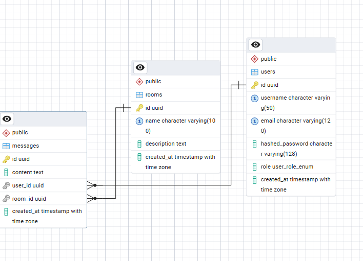
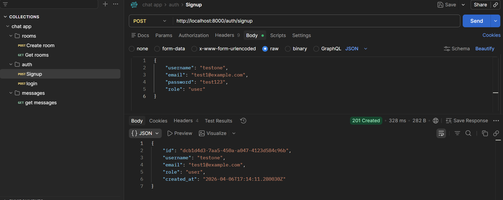
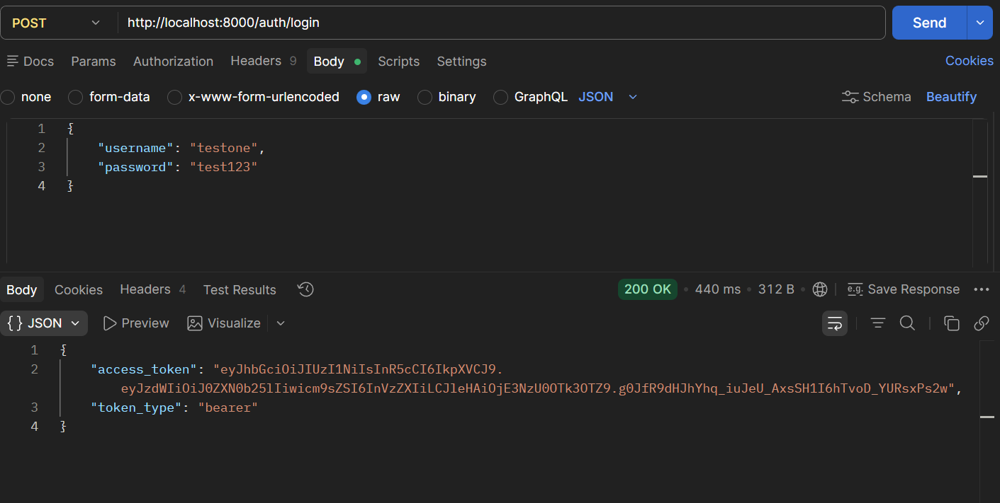
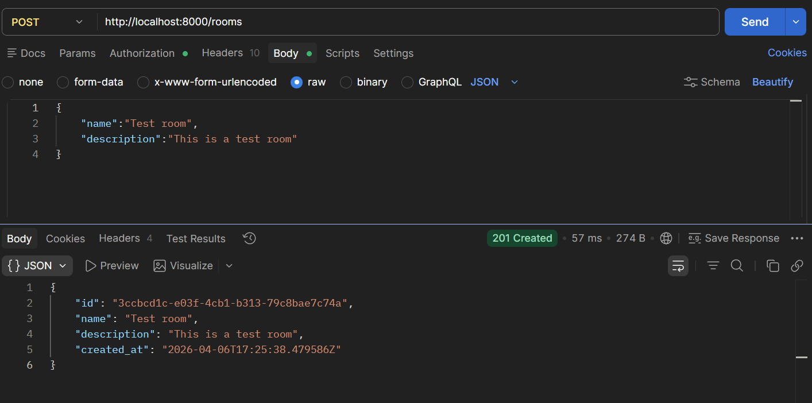
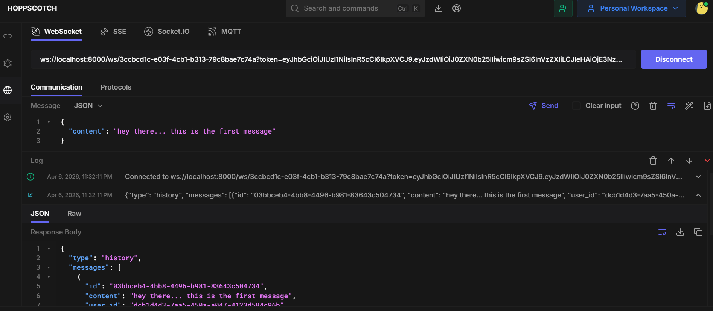
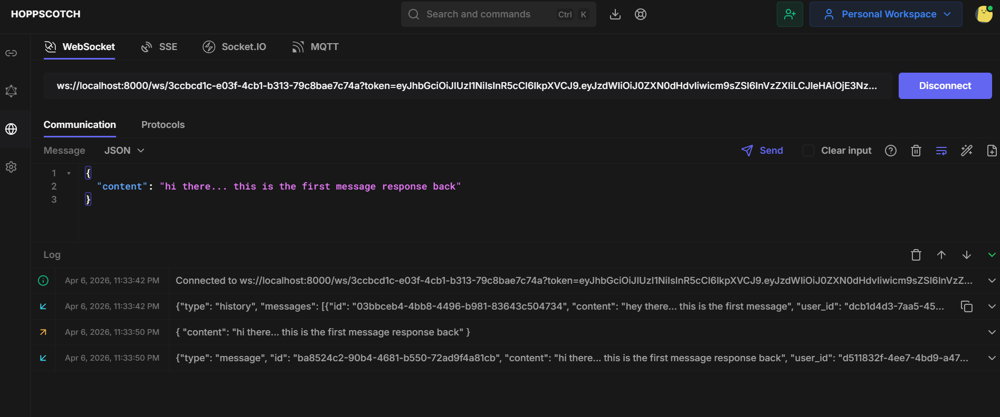
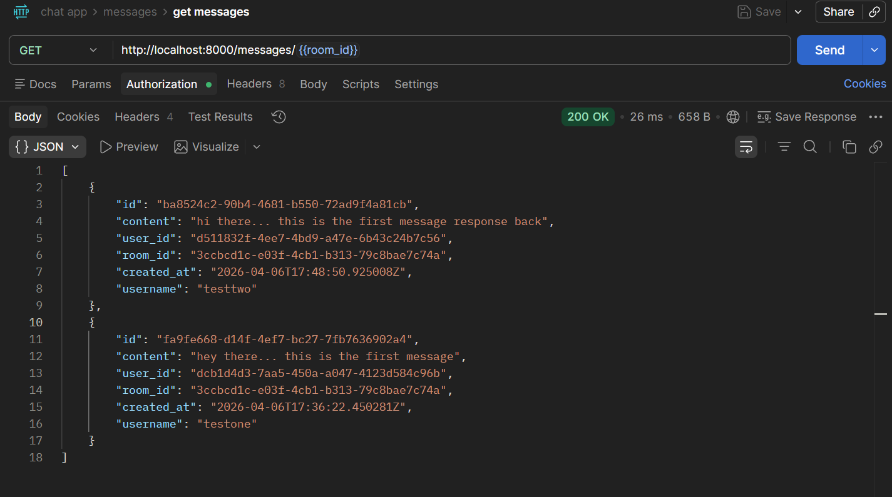
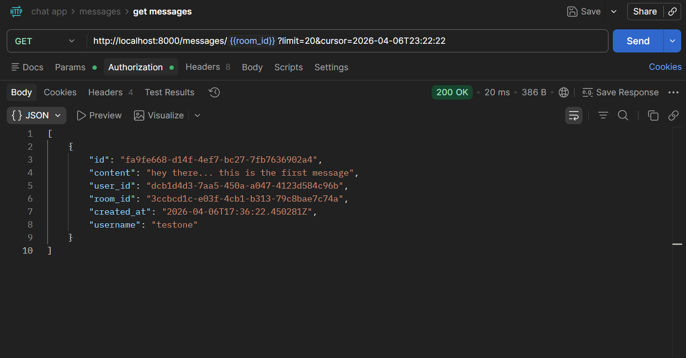

# FastAPI Chat Application

A real-time chat application built with **FastAPI**, featuring **JWT authentication**, **role-based access control (RBAC)**, **WebSocket communication**, and **PostgreSQL persistence**.

---

## Features

- JWT Authentication (Signup & Login)
- Role-Based Access Control (Admin/User)
- Real-time chat using WebSockets
- PostgreSQL database integration with SQLAlchemy 2.0
- Chat rooms with message persistence
- Cursor-based pagination for chat history

---

---

## Environment & Setup

### 1. Create Virtual Environment

```bash
python -m venv venv
.\venv\Scripts\activate
```

### 2. Install Dependencies

```bash
pip install -r requirements.txt
```

---

### Auth Endpoints

####  Signup
- Registers a new user
- Hashes password before storing

#### Login
- Verifies credentials
- Returns JWT token
- Token contains:
  - `sub` (username)
  - `role`
  - `exp` (expiration)

---

### RBAC Dependency

Reusable dependency to:
- Restrict routes based on roles
- Example:
  - Admin-only routes
  - User-specific access control

---

## WebSocket Chat

### Endpoint

```
/ws/{room_id}?token=JWT_TOKEN
```

---

### Features

- JWT authentication for WebSocket connection
- Load recent messages (cursor-based pagination)
- Broadcast messages to all users in a room
- Store messages in database

---

## Database Design

### Models

####  User
- id
- username
- hashed_password
- role

#### Room
- id
- name
- description

#### Message
- id
- content
- user_id (FK → User)
- room_id (FK → Room)
- created_at

---

### Relationships

- One **User → Many Messages**
- One **Room → Many Messages**

---

## Database Schema





---

##  API Testing (Postman)










## Running the Application

```bash
uvicorn app.main:app --reload
```

---